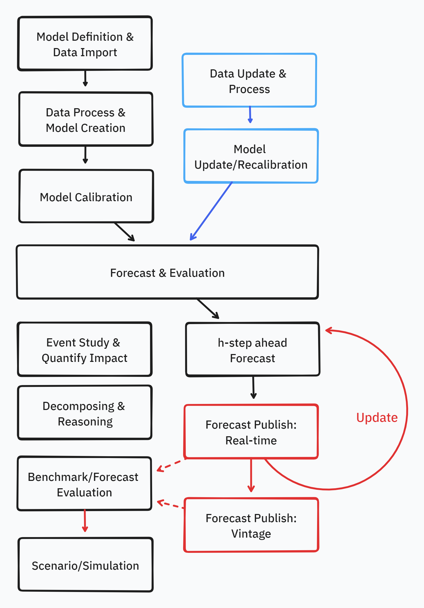

# juila implementations of Bayesian Vector Autoregressive (BVAR) framework
 Toolkit julia source codes and example outputs for Bayesian (Structural) Vector Autoregressive (VAR) models. There are identification strategies in multivariabe time series analysis that requires bayesian framework, such as, 
 * Dynamic probabilistic forecasting estimations
 * Stochastic volatility
 * Time-varying parameters
 * 'Big-data' or large dimension models
 * Structural identification (partial-equilibrium)

 A lot of the research and source codes are mainly written in MATLAB. The purpose of this repository is to direct-transalte those source codes from academic research and codes publicly available into open-sourced [julia programming languge](https://julialang.org/). This repository does not claim original authorship of the algorithms translated and used, and I recommend users to see the original research cited below.

 This repository also includes applications of the models, such as estimation of impulse responses, foreasting, and scenarios/simulations.

 

## Contents of source code
 | Source code | Model framework        | References
 --- | --- | --- 
 | <ul><li>[ ] bar-sv</li></ul> | Bayesian AR application with state-space stochastic volatility | Mein: technically not multivariate but a good baseline use case
 | <ul><li>[ ] bsts</li></ul> | Bayesian Structural Time Series model | Mein: technically not multivariate but a good baseline use case
 | <ul><li>[x] bvar</li></ul> | Bayesian VAR model with Gibbs sampling (Minnesota-prior)   | Gary Koop and [Dimitris Korobilis replication](https://sites.google.com/site/dimitriskorobilis/matlab) of [Christiano et al. (2016)](https://onlinelibrary.wiley.com/doi/pdf/10.3982/ECTA11776)
 | <ul><li>[ ] bvar-vp</li></ul> | Bayesian VAR model with varying prior for extreme episodes | [Cascaldi-Garcia - Pandemic prior](https://sites.google.com/site/cascaldigarcia/pandemic-priors-bvar)
 | <ul><li>[x] tvp-var</li></ul> | Time-varying parameter VAR with stochastic volatility (Code directly available; application example of macroeconomic consumer sentiment) | [Harron Mumtaz replication code](https://sites.google.com/site/hmumtaz77/research-papers) 
 | <ul><li>[x] bh-bsvar</li></ul> | Bayesian Structural Vector Autoregressive Model with Sign Restriction  | [Baumeister and Hamilton (2015) replication code](https://onlinelibrary.wiley.com/doi/abs/10.3982/ECTA12356)
 | <ul><li>[ ] mf-var</li></ul> | Mixed-frequency VAR model  | [Harron Mumtaz replication code](https://sites.google.com/site/hmumtaz77/research-papers) 
 | <ul><li>[x] dfm</li></ul> | Dynamic Factor Model | 
