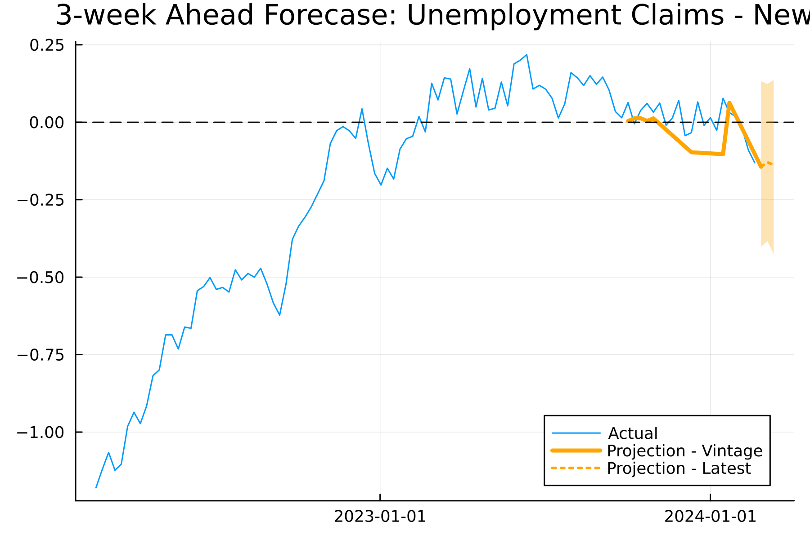
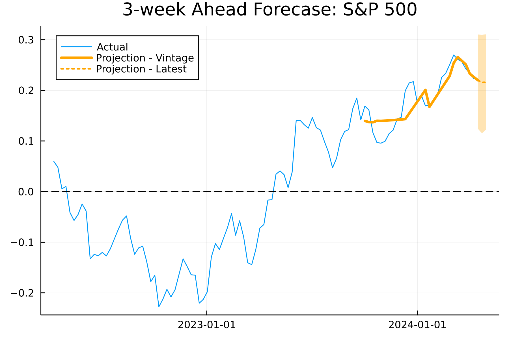
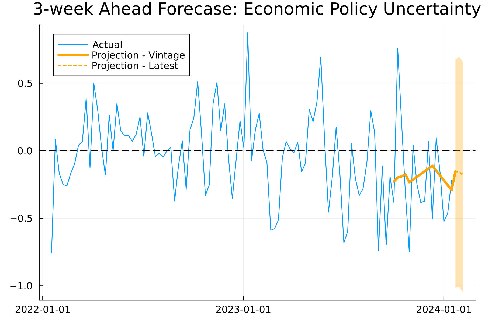
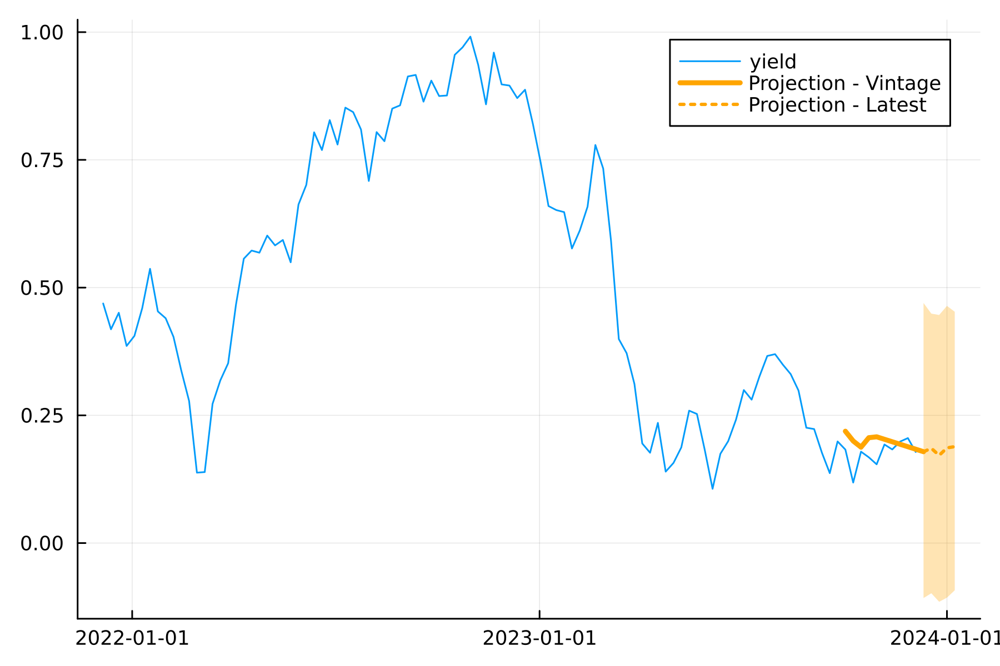

# Macroeconomic Forecast using Bayesian Vector Autoregressive (BVAR) framework
Application of Bayesian (Structural) Vector Autoregressive (VAR) models in building a simple forecast and scenario toolkit, and visualization of latest and vintages of projections. The model identifies,

* Weekly Unemployment Claims
* S&P 500 Index
* Economic Policy Uncertainty
* Short-term Treasury Yield

## Projection Visualization
The projections are based on the latest available data at the time of last repository-updated run forecasts. This repository is not be updated in weekly frequency.

Model is fit and forecasts projected in year-over-year growth rate of the weekly frequency data.

